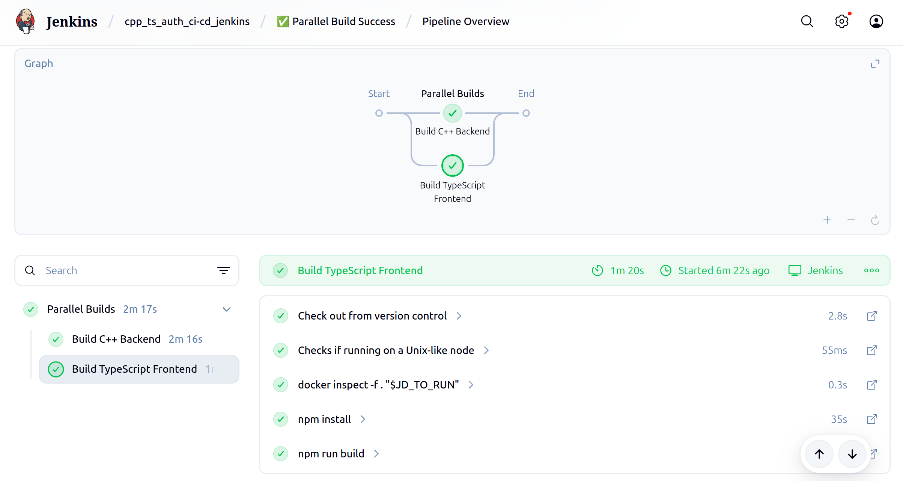

# C++ & TypeScript Authentication App

## Demo


## Pengujian

```bash
# Register
curl -X POST http://localhost:18080/register \
  -H "Content-Type: application/json" \
  -d '{"username":"user","password":"secret"}'

# Login
curl -X POST http://localhost:18080/login \
  -H "Content-Type: application/json" \
  -d '{"username":"user","password":"secret"}'

# Dashboard (pakai token dari hasil login)
curl http://localhost:18080/dashboard \
  -H "Authorization: Bearer <JWT_TOKEN>"

```

## Detail Cara Menjalankan dan Membuat dari Nol

## Database

```bash
cd db_pg
psql -U postgres
```

## Backend

**Menjalankan**:

```bash
# lakukan dari folder /be_cpp/
git submodule update --init --recursive

./run.sh
# ./be_cpp/build/server
```

**Membuat proyek dari nol**:

```bash
# tambahkan library
# pastikan jalankan dari /cpp_ts_auth/
git submodule add https://github.com/Thalhammer/jwt-cpp.git be_cpp/lib/jwt-cpp
git submodule add https://github.com/CrowCpp/Crow.git be_cpp/lib/Crow
git submodule add https://github.com/hilch/Bcrypt.cpp.git be_cpp/lib/bcrypt
git submodule add https://github.com/jtv/libpqxx.git be_cpp/lib/libpqxx

cd be_cpp

mkdir build && cd build
mkdir -p ../log
echo "================== START of log ==================" > ../log/build.log
echo "================== log for cmake .. ==================" >> ../log/build.log
cmake .. >> ../log/build.log
echo "================== log for make ==================" >> ../log/build.log
make >> ../log/build.log
echo "================== END of log ==================" >> ../log/build.log
./server
```

## Frontend

**Menjalankan**:

```bash
npm install
npm start
```

**Membuat proyek dari nol**:

```bash
npx create-react-app fe_ts --template typescript
cd fe_ts
npm install react-router-dom
npm start
```

---

## Jenkins

Cara melakukan CI (continous integration) dengan Jenkins :

**Langkah 1** : Siapkan container Jenkins (customer)

```bash
# build customer docker image for jenkins (docker installed inside)
docker build -t my-jenkins:lts -f Dockerfile.jenkins .

# remove old plain jenkins (if exists)
docker stop jenkins
docker rm jenkins

# cek ID group docker di host
getent group docker

# run the custom jenkins image
docker run \
  --name jenkins \
  -p 8080:8080 \
  -p 50000:50000 \
  -v jenkins-data:/var/jenkins_home \
  -v /var/run/docker.sock:/var/run/docker.sock \
  --group-add 1001 \
  my-jenkins:lts
```

**Langkah 2** : Buat new build (pipeline), tambahkan GithubSCM, install plugins yang dibutuhkan.

- tampilan pipeline sukses (parallel build)



- tampilan pipeline sukses (serial build (v1))


**Catatan** :

- Gunakan nama yang deskriptif untuk setiap build (baik fail maupun success).


- masukkan `DOCKER_USERNAME` DAN `DOCKER_PASSWORD` di *credentials*.


